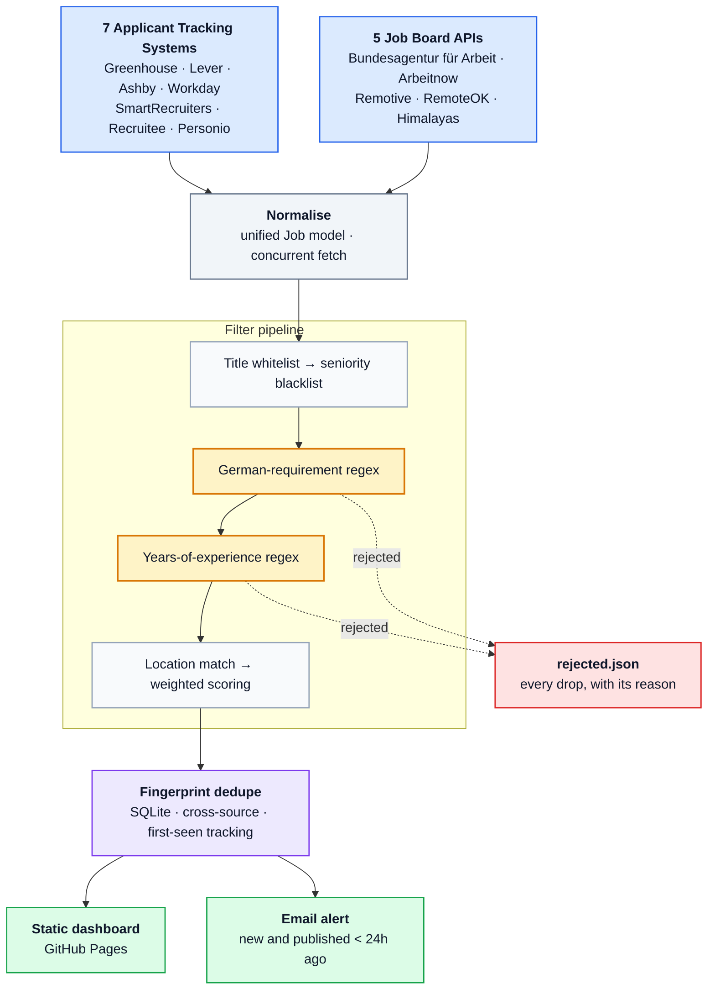

# Job Radar

**A self-hosted job aggregator that pulls postings from 12 official APIs, filters them against a configurable candidate profile, and emails me the matches within an hour of publication.**

[](https://github.com/Siri-cod/job-radar/actions/workflows/fetch.yml)


📊 **[Live dashboard →](https://siri-cod.github.io/job-radar/)**

---

## The problem

Job boards optimise for engagement, not for me. Searching for "Data Analyst, Berlin" across LinkedIn, StepStone and Indeed returns the same postings three times over, mixed with senior roles I can't apply for, roles requiring fluent German, and listings that have been open for six weeks. Meanwhile, the postings that matter most — freshly published roles at companies I'd actually want to work for — are buried.

Two observations shaped this project:

1. **Company career pages publish before the aggregators do.** Most companies use an applicant tracking system (Greenhouse, Lever, Personio…), and nearly all of these expose a public JSON endpoint. Reading them directly means seeing a posting the moment it goes live, with an exact timestamp and a direct application link.
2. **Speed matters more than breadth.** Applying within 24 hours of publication puts you in the first handful of applications a recruiter reads. A tool that surfaces 20 fresh, genuinely-matching roles beats one that surfaces 500 stale ones.

So: query the sources directly, filter hard, and alert fast.

---

## What it does



<sub>Amber steps are the two filters that carry most of the weight — see [Engineering highlights](#engineering-highlights).</sub>

Runs hourly on GitHub Actions. Total infrastructure cost: **€0**.

---

## Engineering highlights

### Requirement extraction with regex, not keyword lists

Two filters do most of the work, and both are harder than they look.

**"Does this role require German?"** A naive keyword match on `"German"` or `"Deutsch"` fails immediately: every Berlin posting contains *Deutschland*, and half of them mention *Deutsche Bahn* as a client. The distinction that matters is whether German is stated as a **capability requirement** — and postings phrase that a dozen different ways across two languages.

The module matches requirement phrasings while explicitly whitelisting the "nice to have" constructions, which are checked first so they override:

| Input | Verdict |
|---|---|
| `Sehr gute Deutschkenntnisse in Wort und Schrift` | required → reject |
| `Verhandlungssicheres Deutsch` | required → reject |
| `Fluent German required` | required → reject |
| `German language skills at C1 level` | required → reject |
| `German is a plus, English is our working language` | **optional → keep** |
| `We are based in Berlin, Deutschland` | **not a requirement → keep** |
| `Deutsch ist von Vorteil` | **optional → keep** |

**"How many years of experience does it demand?"** Ranges have to resolve to their lower bound (`3-5 years` means the floor is 3, which is acceptable), open-ended requirements to their stated minimum (`5+ years` means 5, which is not), and numbers outside an experience context have to be ignored entirely.

| Input | Extracted | Verdict |
|---|---|---|
| `3-5 years of experience in Python` | 3 | keep |
| `5+ years of professional experience` | 5 | reject |
| `Mindestens 4 Jahre Berufserfahrung` | 4 | reject |
| `0-2 years, graduates welcome` | no floor | keep |
| `We have 20 years of company history` | *(not an experience claim)* | keep |

Both filters ship with the table above as executable test cases. A bug found during development — descriptions shorter than 120 characters silently skipped the check, letting a `Sehr gute Deutschkenntnisse` posting through — is exactly the kind of thing these catch.

### Cross-source deduplication

The same role legitimately appears in up to four feeds — the company's Greenhouse board, Arbeitnow, the Bundesagentur listing, and a remote-jobs aggregator — each with a different ID, title casing and location string. Each posting is fingerprinted on a normalised `company | title | location` triple; when duplicates collide, the highest-scoring variant survives (which naturally prefers the company's own posting, since direct-from-ATS sources carry a score bonus).

A SQLite table records the first time each fingerprint was seen. That's what makes "**new** posting" meaningful rather than "posting that happens to be in this run", and it guarantees a role is never emailed twice.

### Transparent scoring

Filtering is destructive, so every decision is auditable. Each surviving posting carries the list of reasons it scored what it did (`+6 english speaking`, `experience: 2 years`, `target city: Berlin`) and these render as tags on the dashboard. Every *rejected* posting is written to `data/rejected.json` with its rejection reason, so it's immediately obvious whether the filters are too aggressive — instead of silently returning an empty page.

### Failure isolation

Twelve sources are fetched concurrently, each in its own thread with retry and backoff. A source that 404s, rate-limits or changes its schema logs a warning and contributes zero rows; the other eleven complete normally. Career-page slugs go stale constantly, so partial failure is the expected steady state, not an exception.

### A deliberate decision not to scrape

LinkedIn, StepStone, Indeed and Xing all prohibit automated access in their terms of service and defend against it technically. Scraping them would produce a system that is both legally exposed and permanently one anti-bot update away from breaking.

Instead the dashboard renders pre-built search URLs for each platform with `posted in last 24 hours` and `sort by date` already applied — one click to a filtered view — and the README documents setting up each platform's own email alerts into the same inbox. Coverage stays comparable; the system stays maintainable and within terms.

*This felt worth writing down: the interesting engineering decision here was choosing what not to build.*

---

## Data sources

**Direct from company ATS** — exact publication timestamps, direct application links, typically live before aggregators pick them up.

| System | Notes |
|---|---|
| Greenhouse | Dominant among US/EU tech companies |
| Lever | Common at startups |
| Ashby | Newer startup cohort |
| SmartRecruiters | Enterprise |
| Recruitee | Mid-size European companies |
| Personio | **The default for German SMEs** — XML feed rather than JSON |
| Workday | SAP, Siemens, Zalando, NVIDIA, Bayer. Publication dates arrive as relative strings (`Posted 3 Days Ago`) and are parsed back into timestamps |

**Public job-board APIs**

| Source | Notes |
|---|---|
| Bundesagentur für Arbeit | Germany's federal employment agency — the broadest official coverage of the German market |
| Arbeitnow | German roles, includes a visa-sponsorship flag |
| Remotive · RemoteOK · Himalayas | Global remote roles |

---

## Tech stack

Python 3.12 · `requests` · `PyYAML` · `python-dateutil` · SQLite · GitHub Actions · GitHub Pages

No framework and only three dependencies — the problem doesn't need more, and every dependency is a thing that breaks unattended at 3am. The dashboard is a single self-contained HTML file with no build step: filtering, search and sorting run client-side over a JSON payload embedded at render time.

~1,250 lines of Python across 22 modules.

---

## Project structure

```
job-radar/
├── config.yaml                  # Candidate profile — the entire tuning surface
├── companies.yaml               # 72 target companies, grouped by ATS
├── requirements.txt
│
├── src/
│   ├── main.py                  # Pipeline orchestration
│   ├── models.py                # Job model, fingerprinting, age calculation
│   ├── scoring.py               # Filter chain and weighted scoring
│   ├── requirements_filter.py   # German / years-of-experience regex
│   ├── store.py                 # SQLite dedupe and first-seen tracking
│   ├── render.py                # Static dashboard generation
│   ├── notify.py                # SMTP alerts
│   └── sources/
│       ├── base.py              # HTTP session, retry, date parsing, HTML stripping
│       ├── ats_*.py             # 7 applicant tracking systems
│       └── agg_*.py             # 5 job-board APIs
│
├── .github/workflows/fetch.yml  # Hourly schedule + Pages deployment
├── data/                        # SQLite state, jobs.json, rejected.json
└── docs/                        # Generated dashboard (served by GitHub Pages)
```

Adding a source means writing one function that returns `list[Job]` and registering it — roughly 30 lines. The pipeline needs no changes.

---

## Configuration

Everything tunable lives in `config.yaml`. Editing it triggers a re-run automatically via the workflow's `push` trigger, so retuning never requires touching code.

```yaml
profile:
  titles_any:        [ai engineer, data scientist, data analyst, ...]   # 35 terms
  titles_exclude:    [senior, staff, lead, werkstudent, ...]            # 30 terms
  keywords_boost:    {python: 4, visa: 5, "english speaking": 6, ...}   # weighted
  keywords_exclude:  [security clearance, ...]

requirements:
  max_years_experience: 3
  exclude_german_required: true
  keep_when_description_missing: true    # some sources omit the body text

locations:
  countries:    [DE, NL, IE, AT, CH, ...]
  cities:       [Berlin, Munich, Amsterdam, ...]
  allow_remote: true

filters:
  freshness_days:      7     # ignore anything older
  alert_window_hours: 24     # email threshold
  min_score:          20     # dashboard threshold
```

---

## Running it yourself

```bash
git clone https://github.com/Siri-cod/job-radar.git
cd job-radar
pip install -r requirements.txt
python -m src.main --dry-run          # fetch and build, skip email
open docs/index.html
```

Useful flags: `--only greenhouse,arbeitnow` restricts to specific sources while debugging.

<details>
<summary><b>Deploying your own instance (~10 minutes)</b></summary>

1. **Fork this repository.** Public repos get unlimited Actions minutes.

2. **Grant Actions write access** — `Settings → Actions → General → Workflow permissions → Read and write permissions`. The workflow commits the refreshed dataset back to the repo.

3. **Enable Pages** — `Settings → Pages → Source → GitHub Actions`.

4. **Optional: email alerts.** Add these as `Settings → Secrets and variables → Actions` secrets. Gmail requires an [app password](https://myaccount.google.com/apppasswords), not your account password.

   | Secret | Example |
   |---|---|
   | `SMTP_HOST` | `smtp.gmail.com` |
   | `SMTP_PORT` | `587` |
   | `SMTP_USER` | your address |
   | `SMTP_PASS` | 16-character app password |
   | `MAIL_TO` | destination address |

5. **Edit `config.yaml`** with your own profile, then commit. Pushing changes to it triggers a run.

6. **Trigger manually** — `Actions → Job Radar → Run workflow` — to verify before the hourly schedule takes over.

Adjust frequency in `.github/workflows/fetch.yml`:

```yaml
- cron: "0 * * * *"        # hourly (default)
- cron: "*/30 * * * *"     # every 30 minutes
- cron: "0 7,13,19 * * *"  # three times daily
```

</details>

---

## Known limitations

- **Two sources omit description text.** The Bundesagentur and SmartRecruiters endpoints return metadata without a job body, so the German and experience filters cannot evaluate those postings. `keep_when_description_missing` controls the trade-off; it defaults to keeping them, favouring recall over precision. Fetching each detail page would close the gap at a significant cost in request volume.
- **Career-page slugs drift.** Companies rename their boards, and there's no discovery API. Broken slugs surface as 404 warnings in the run log and need occasional manual pruning.
- **Coverage is bounded by the target list.** Direct ATS access is precise but only reaches companies I've named. The aggregator sources provide breadth; the two approaches are complementary by design.

## Possible extensions

- Embedding-based semantic matching against a CV, replacing keyword scoring
- Application tracking — mark applied/rejected on the dashboard, persisted alongside the dedupe state
- Salary parsing and normalisation across currencies
- Telegram or Slack delivery in addition to email

---

## License

MIT

---

<sub>Built by [Siri-cod](https://github.com/Siri-cod). If you're a recruiter who found this: it was written to help me find you faster.</sub>
